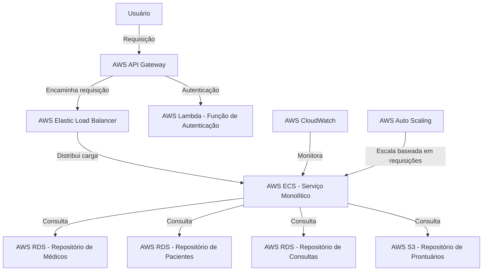

# Arquitetura nuvem

Os seguintes serviços da AWS foram escolhidos para atender aos requisitos funcionais e não funcionais descritos no desafio.

1. **AWS Elastic Load Balancer (ELB)**: O ELB é usado para distribuir automaticamente o tráfego de entrada entre várias instâncias do AWS ECS. Isso ajuda a alcançar maior tolerância a falhas em suas aplicações e a satisfazer o requisito de alta disponibilidade.

2. **AWS ECS (Elastic Container Service)**: O ECS é um serviço de gerenciamento de contêineres altamente escalável e de alto desempenho. Ele suporta Docker e permite executar e gerenciar aplicações em contêineres. O ECS foi escolhido para hospedar o serviço monolítico devido à sua escalabilidade e eficiência.

3. **AWS RDS (Relational Database Service)**: O RDS facilita a configuração, operação e escalabilidade de um banco de dados relacional na nuvem. Ele foi escolhido para hospedar os repositórios de médicos, pacientes e consultas devido à sua facilidade de uso, desempenho e escalabilidade.

4. **AWS S3 (Simple Storage Service)**: O S3 é um serviço de armazenamento de objetos que oferece escalabilidade, disponibilidade de dados, segurança e desempenho. Ele foi escolhido para hospedar o repositório de prontuários devido à sua durabilidade, segurança e facilidade de uso.

5. **AWS Lambda**: O Lambda permite executar código sem provisionar ou gerenciar servidores. Ele foi escolhido para lidar com a autenticação de usuários devido à sua escalabilidade, desempenho e capacidade de executar código em resposta a eventos.

6. **AWS CloudWatch**: O CloudWatch é usado para coletar e rastrear métricas, coletar e monitorar arquivos de log e responder a eventos do sistema. Ele foi escolhido para monitorar o serviço monolítico devido à sua capacidade de fornecer insights operacionais.

7. **AWS Auto Scaling**: O Auto Scaling permite ajustar automaticamente a capacidade para manter o desempenho estável e previsível a um custo baixo. Ele foi escolhido para lidar com a escalabilidade do serviço monolítico com base no número de requisições.

Esses serviços da AWS, quando usados em conjunto, podem atender aos requisitos funcionais e não funcionais descritos no arquivo TXT, fornecendo uma solução robusta, escalável e segura para o sistema de telemedicina.

