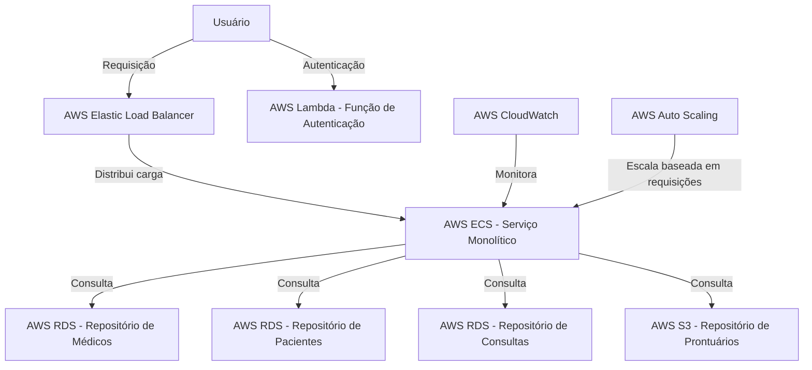

# Arquitetura nuvem

```mermaid 
graph TB
    A[Usuário] -->|Requisição| B[AWS Elastic Load Balancer]
    B -->|Distribui carga| D[AWS ECS - Serviço Monolítico]
    D -->|Consulta| G[AWS RDS - Repositório de Médicos]
    D -->|Consulta| H[AWS RDS - Repositório de Pacientes]
    D -->|Consulta| I[AWS RDS - Repositório de Consultas]
    D -->|Consulta| J[AWS S3 - Repositório de Prontuários]
    A -->|Autenticação| E[AWS Lambda - Função de Autenticação]
    M[AWS CloudWatch] -->|Monitora| D
    N[AWS Auto Scaling] -->|Escala baseada em requisições| D
```
