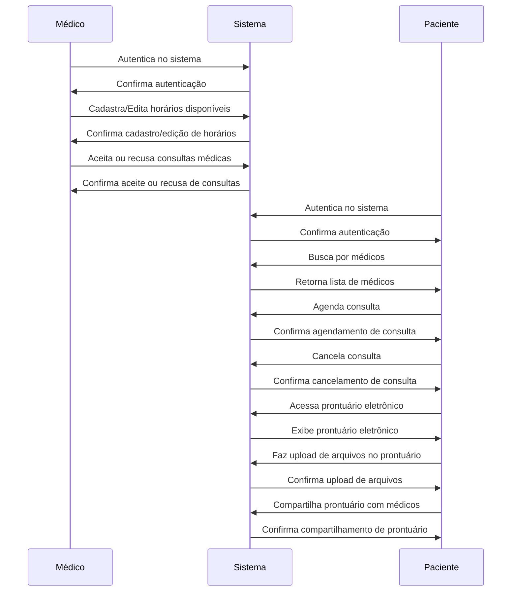
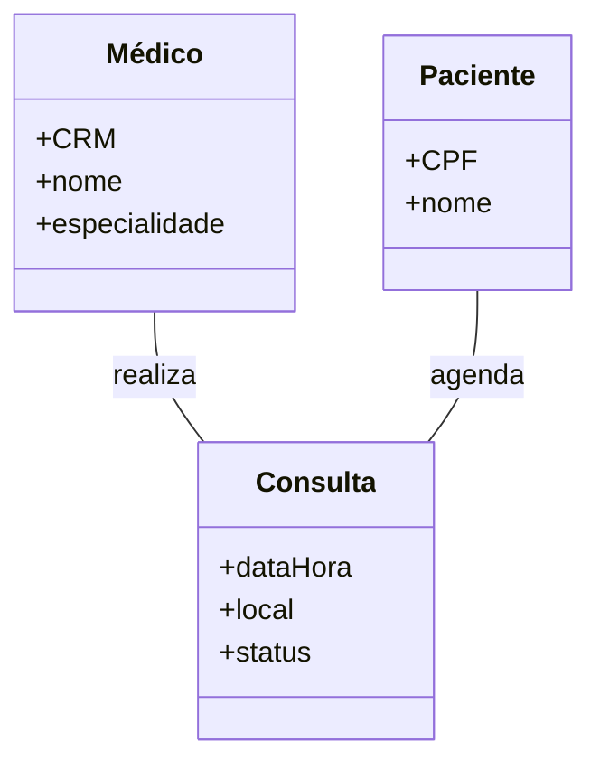
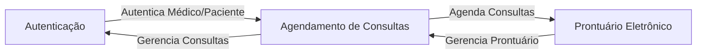

# Glossário 

### Entidades

- **Médico:** Profissional de saúde que realiza consultas médicas através do sistema.
- **Paciente:** Usuário que busca atendimento médico através do sistema.

### Valores

- **CRM:** Identificador único de um médico.
- **CPF:** Identificador único de um paciente.

### Agregados

- **Consulta:** Representa uma consulta médica agendada no sistema. Inclui informações como o médico, o paciente, a data e a hora da consulta.

### Eventos de Domínio

- **Autenticação do Usuário:** Ocorre quando um médico ou paciente se autentica no sistema.
- **Cadastro/Edição de Horários Disponíveis:** Ocorre quando um médico cadastra ou edita seus horários disponíveis para consultas.
- **Aceite ou Recusa de Consultas Médicas:** Ocorre quando um médico aceita ou recusa uma consulta médica agendada.
- **Busca por Médicos:** Ocorre quando um paciente busca por médicos disponíveis no sistema.
- **Agendamento de Consultas:** Ocorre quando um paciente agenda uma consulta com um médico.
- **Cancelamento de Consultas:** Ocorre quando um paciente cancela uma consulta agendada.
- **Acesso ao Prontuário Eletrônico:** Ocorre quando um paciente acessa seu prontuário eletrônico.
- **Upload de Arquivos no Prontuário:** Ocorre quando um paciente faz o upload de arquivos, como exames e laudos médicos, em seu prontuário eletrônico.
- **Compartilhamento do Prontuário:** Ocorre quando um paciente compartilha seu prontuário eletrônico com médicos.

### Serviços de Domínio

- **Serviço de Autenticação:** Responsável por autenticar médicos e pacientes no sistema.
- **Serviço de Agendamento:** Responsável por gerenciar o agendamento e cancelamento de consultas.
- **Serviço de Prontuário Eletrônico:** Responsável por gerenciar o acesso, upload e compartilhamento de arquivos no prontuário eletrônico.

### Repositórios

- **Repositório de Médicos:** Responsável por persistir e recuperar informações de médicos.
- **Repositório de Pacientes:** Responsável por persistir e recuperar informações de pacientes.
- **Repositório de Consultas:** Responsável por persistir e recuperar informações de consultas.

### Políticas

- **Política de Autenticação:** Define as regras para autenticação de médicos e pacientes no sistema.
- **Política de Agendamento:** Define as regras para o agendamento e cancelamento de consultas.
- **Política de Prontuário Eletrônico:** Define as regras para o acesso, upload e compartilhamento de arquivos no prontuário eletrônico.

# Documento de Eventos de Domínio

Este documento apresenta o diagrama de eventos de domínio para 
o sistema de telemedicina desenvolvido pela startup Health&Med. 
O diagrama foi criado usando a notação de diagrama Mermaid e
representa os principais eventos de domínio que ocorrem no
sistema.

Os eventos de domínio são ações significativas que ocorrem no
sistema e que são relevantes para o domínio do problema. Eles
representam algo importante que aconteceu e que o sistema 
precisa responder. No contexto deste sistema de telemedicina,
os eventos de domínio incluem ações como autenticação de 
usuários, agendamento e cancelamento de consultas,
e interações com o prontuário eletrônico.

O diagrama a seguir descreve a sequência desses eventos,
mostrando como os diferentes participantes (Médico, Sistema e Paciente)
interagem entre si. 

# Modelo de domínio

# Contextos delimitados

Foram identificados os seguintes contextos delimitados no sistema de telemedicina:
* Autenticação: Responsável por autenticar médicos e pacientes no sistema.
* Agendamento de Consultas: Responsável por gerenciar o agendamento e cancelamento de consultas.
* Prontuário Eletrônico: Responsável por gerenciar o acesso, upload e compartilhamento de arquivos no prontuário eletrônico.
 

